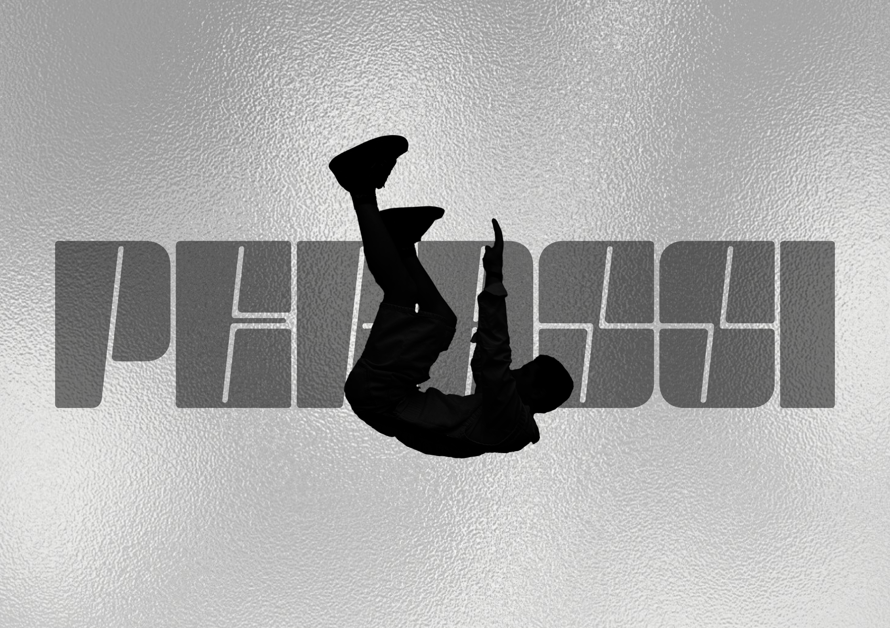

<p align="center">
  
</p>

<p align="center">
  <b>Lorenzo Perassi — Developer, Creator, Builder</b>
  <br>
  <i>Costruisco prodotti digitali dove codice, design e creatività si incontrano</i>
</p>

<div align="center">
  <a href="https://perassilorenzo.github.io/portfolio">Portfolio</a> •
  <a href="https://linktr.ee/lollo_pera">Linktree</a> •
  <a href="mailto:pera.busines@gmail.com">Email</a>
</div>

<br>

<div align="center">
  <picture>
    <source media="(prefers-color-scheme: dark)" srcset="https://github-readme-streak-stats.herokuapp.com/?user=perassilorenzo&theme=dark&hide_border=true&date_format=j%20M%5B%20Y%5D&background=0D1117&fire=FF6F00&ring=FF6F00&currStreakLabel=FF6F00">
    
  </picture>
  <picture>
    <source media="(prefers-color-scheme: dark)" srcset="https://github-readme-stats.vercel.app/api?username=perassilorenzo&theme=dark&hide_border=true&include_all_commits=true&count_private=true&show_icons=true&bg_color=0D1117&icon_color=FF6F00&title_color=FF6F00&text_color=FFFFFF">
    
  </picture>
  <br>
  <picture>
    <source media="(prefers-color-scheme: dark)" srcset="https://github-readme-stats.vercel.app/api/top-langs/?username=perassilorenzo&theme=dark&hide_border=true&layout=compact&bg_color=0D1117&text_color=FFFFFF">
    
  </picture>
</div>

<br>

<div align="center">
  <picture>
    <source media="(prefers-color-scheme: dark)" srcset="https://github-readme-activity-graph.vercel.app/graph?username=perassilorenzo&theme=react-dark&hide_border=true&bg_color=0D1117&color=FF6F00&line=FF6F00&point=FFFFFF&area=true">
    
  </picture>
</div>

---

## About Me

Studio informatica in Italia, ma il mio percorso non si limita alla scuola. Costruisco prodotti digitali, sperimento con il design e lavoro su progetti reali che uniscono tecnologia e creatività.

Ogni progetto è un modo per imparare qualcosa di nuovo — non aspetto la laurea per iniziare a costruire.

🔹 **Sviluppatore** — web development, app, automazione  
🔹 **Creator** — Diario di uno 09 (Instagram, TikTok, YouTube)  
🔹 **Stage** @ Omnia4Web — content creation, video editing, grafica  
🔹 **Stage FSL** @ Bertolotto Porte — digitalizzazione archivi e gestione documenti  
🔹 **Cliente** @ CRYBU S.R.L. — design e prototipazione maglie per presentazione investitori

---

## Featured Projects

### [Custom Configurator](https://github.com/perassilorenzo/custom-configurator)

> Il mio progetto principale. Una piattaforma nata dall'unione tra software e moda custom — permette ai creator fashion di offrire personalizzazioni digitali ai clienti in tempo reale, con anteprima SVG e gestione ordini strutturata.
> Un prodotto reale che risolve un problema concreto: rendere la personalizzazione accessibile e scalabile.
> _Vanilla JS · CSS · Formspree · Modular seller system_

### [Portfolio](https://perassilorenzo.github.io/portfolio)

> Il mio spazio personale su web — progetti, lavori di design e contenuti creativi, tutto in un unico posto.
> _HTML · CSS · GitHub Pages_

### [Diario di uno 09](https://www.instagram.com/diario_di_uno_09)

> Progetto personale di content creation dove documento il percorso tra tecnologia, creatività, disciplina e costruzione di idee. Non è un account social — è un diario pubblico di come imparo costruendo.
> _Content · Video · Design · Storytelling_

### [Bertolotto Stage](https://github.com/perassilorenzo/bertolotto-stage)

> Esercizi C# sviluppati durante lo stage — il primo contatto reale tra quello che studio a scuola e il mondo del lavoro.
> _C# · .NET · Windows Forms_

### [CS50x](https://github.com/perassilorenzo/cs50x)

> Harvard's CS50x — appunti, esercizi e problem set. Un percorso strutturato per consolidare le basi della computer science.
> _C · Python · SQL_

### [Study Archive](https://github.com/perassilorenzo/study-archive)

> Archivio personale di appunti, assignment e risorse — organizzato per materia e anno scolastico, un riferimento continuo.
> _Documentazione · C#_

---

## Tech Stack

```
Development:
  Frontend     HTML · CSS · JavaScript
  Backend      C# · .NET · Python
  Database     SQL · SQLite

Creative:
  Video        CapCut · Lightroom
  Design       Canva · Figma
  Content      Instagram · TikTok · YouTube

Workflow:
  Versioning   Git · GitHub
  Terminal     Bash · Linux
  Automation   n8n · GitHub Actions
```

---

## Content & Creative Work

**Diario di uno 09** è il mio progetto personale di content creation — documento il percorso tra tecnologia, creatività e costruzione di idee. Non è un semplice account social: è un archivio pubblico di come imparo, provo e costruisco.

<p align="center">
  <a href="https://www.instagram.com/diario_di_uno_09"></a>&nbsp;
  <a href="https://www.tiktok.com/@diario_di_uno_09"></a>&nbsp;
  <a href="https://www.youtube.com/@diario_di_uno_09"></a>&nbsp;
  <a href="https://www.linkedin.com/in/lorenzo-perassi-46057a38b"></a>&nbsp;
  <a href="https://perassilorenzo.github.io/portfolio"></a>&nbsp;
  <a href="mailto:pera.busines@gmail.com"></a>
</p>

---

## Visual Contributions

<div align="center">
  <picture>
    <source media="(prefers-color-scheme: dark)" srcset="https://github-profile-trophy.vercel.app/?username=perassilorenzo&theme=radical&no-frame=true&no-bg=true&row=1&column=6">
    
  </picture>
</div>

<div align="center">
  <picture>
    <source media="(prefers-color-scheme: dark)" srcset="https://raw.githubusercontent.com/perassilorenzo/perassilorenzo/main/github-contribution-grid-snake-dark.svg">
    
  </picture>
</div>

---

## Currently Building

- **Custom Configurator** — da MVP a piattaforma completa per venditori di custom fashion
- **Tech × Fashion** — sperimentare connessioni tra codice e sartoria handmade
- **Content Creation** — documentare il processo di costruzione, non solo il risultato
- **Open Source** — imparare contribuendo, costruire in pubblico

---

<p align="center">
  <i>Ogni progetto è un passo avanti. Ogni errore è una lezione. Ogni idea merita di essere costruita.</i>
  <br><br>
  
</p>
