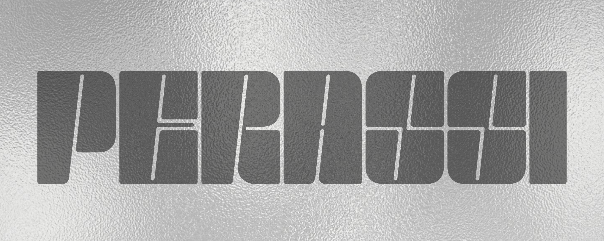

<p align="center">
  
</p>

<p align="center">
  <b>Lorenzo Perassi — Developer, Creator, Builder</b>
  <br>
  <i>Costruisco prodotti digitali dove codice, design e creatività si incontrano</i>
</p>

<div align="center">
  <a href="https://perassilorenzo.github.io/portfolio">Portfolio</a> •
  <a href="https://linktr.ee/lollo_pera">Linktree</a> •
  <a href="mailto:pera.busines@gmail.com">Email</a>
</div>

<br>

<div align="center">
  <picture>
    <source media="(prefers-color-scheme: dark)" srcset="https://github-readme-streak-stats.herokuapp.com/?user=perassilorenzo&theme=dark&hide_border=true&date_format=j%20M%5B%20Y%5D&background=0D1117&fire=FF6F00&ring=FF6F00&currStreakLabel=FF6F00">
    
  </picture>
  <picture>
    <source media="(prefers-color-scheme: dark)" srcset="https://github-readme-stats.vercel.app/api?username=perassilorenzo&theme=dark&hide_border=true&include_all_commits=true&count_private=true&show_icons=true&bg_color=0D1117&icon_color=FF6F00&title_color=FF6F00&text_color=FFFFFF">
    
  </picture>
  <br>
  <picture>
    <source media="(prefers-color-scheme: dark)" srcset="https://github-readme-stats.vercel.app/api/top-langs/?username=perassilorenzo&theme=dark&hide_border=true&layout=compact&bg_color=0D1117&text_color=FFFFFF">
    
  </picture>
</div>

<br>

<div align="center">
  <picture>
    <source media="(prefers-color-scheme: dark)" srcset="https://github-readme-activity-graph.vercel.app/graph?username=perassilorenzo&theme=react-dark&hide_border=true&bg_color=0D1117&color=FF6F00&line=FF6F00&point=FFFFFF&area=true">
    
  </picture>
</div>

---

## Customly

> ### [Customly](https://customly.it)
>
> > Piattaforma di custom fashion che unisce moda e tecnologia — un configuratore digitale per personalizzare abbigliamento in modo semplice e intuitivo. MVP live, sviluppato con **Cloudflare Pages**, **D1** e **R2**.
> > Un prodotto reale che risolve un problema concreto: rendere la personalizzazione accessibile e scalabile.
> > _Vanilla JS · Cloudflare Pages · D1 · R2_

---

## About Me

Studio informatica in Italia, ma il mio percorso non si limita alla scuola. Costruisco prodotti digitali, sperimento con il design e lavoro su progetti reali che uniscono tecnologia e creatività.

Ogni progetto è un modo per imparare qualcosa di nuovo — non aspetto la laurea per iniziare a costruire.

🔹 **Developer** — web development, Cloudflare, automazioni  
🔹 **Creator** — Diario di uno 09 (Instagram, TikTok, YouTube)  
🔹 **Founder** — Customly (custom fashion platform)  
🔹 **Stage** @ Omnia4Web — content creation, video editing, grafica (Mag–Lug 2026)  
🔹 **Stage FSL** @ Bertolotto Porte — digitalizzazione archivi e gestione documenti  
🔹 **Cliente** @ CRYBU S.R.L. — design e prototipazione maglie per presentazione investitori

---

## Tech Stack

```
Development:
  Frontend     HTML · CSS · JavaScript
  Backend      C# · .NET · Python
  Database     SQL · SQLite · D1
  Cloud        Cloudflare Pages · R2 · D1

Creative:
  Video        CapCut · Lightroom
  Design       Canva · Figma
  Content      Instagram · TikTok · YouTube

Workflow:
  Versioning   Git · GitHub
  Terminal     Bash · Linux
  Automation   n8n · GitHub Actions
  Knowledge    Markdown · Dropbox
```

---

## Bertolotto Stage, CS50x, file-uploader, Portfolio, Study Archive

- **bertolotto-stage** — Esercizi C# .NET Windows Forms sviluppati durante lo stage @ Bertolotto Porte. _C# · .NET · Windows Forms_
- **cs50x** — Appunti ed esercizi Harvard CS50 per consolidare le basi della computer science. _C · Python · SQL_
- **file-uploader** — Utility Windows per la copia file, costruita con C# e .NET 10 usando Windows Forms.
- **portfolio** — Portfolio personale su web, showcase di progetti, design e lavoro development. _HTML · CSS · GitHub Pages_
- **study-archive** — Archivio personale di appunti, assignment e risorse, organizzato per materia e anno scolastico. _Documentazione · C#_

---

<p align="center">
  <i>Ogni progetto è un passo avanti. Ogni errore è una lezione. Ogni idea merita di essere costruita.</i>
  <br><br>
  
</p>
