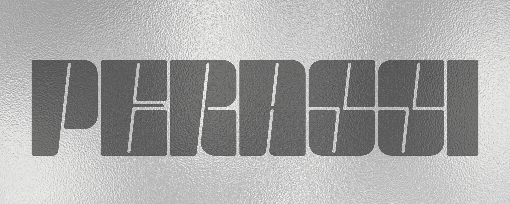

  

  
  
  
  

  
  
  

## Hi, I'm Lorenzo

I'm an **Informatics student** at <a href="http://www.vallauri.edu/public/ita/pagina.asp"><strong>IIS Vallauri</strong></a>, but my work doesn't stop at code: I build projects across **technology, fashion, design, content and business** — and I'm open to collaborating with people and brands that have an interesting idea.

I founded [**Customly**](https://customly.it), a custom fashion platform combining fashion and technology, which I work on every week. I also design and prototype garments with [**CRYBU**](https://crybu.io), build websites, create video content across platforms, and collaborate with clothing brands like [**Aleyesure**](https://aleyesure.com) and [**StageStreetwear**](https://stagestreeware.it).

I've worked on digital content with [**Omnia4Web**](https://omnia4web.com) and done an IT internship at [**Bertolotto Porte**](https://bertolotto.com). I've earned a [**NASA certification on remote sensing**](https://lorenzoperassi.it/assets/ARSET.pdf) ahead of taking part in the [**NASA Space Apps Challenge**](https://www.spaceappschallenge.org/2026/), I'm taking [**Harvard**'s **CS50x**](https://cs50.harvard.edu/x/), and I keep adding new courses and certifications.

The best place to see what I build is my [**portfolio**](https://lorenzoperassi.it) — and if you have an idea, let's build it together: [perassi.lorenzo1804@gmail.com](mailto:perassi.lorenzo1804@gmail.com)

## Languages and Tools

  
  
  
  
  
  
  

## Projects

<table>
  <tr>
    <td width="33%" valign="top">
      <h3><a href="https://customly.it">Customly</a></h3>
      
A platform to request custom clothes, buy base garments, and connect people with customizers.

      
<code>Vanilla JS</code> <code>Cloudflare</code> <code>UX</code>

    </td>
    <td width="33%" valign="top">
      <h3><a href="https://github.com/perassilorenzo/portfolio">Portfolio</a></h3>
      
My personal website for projects, digital identity, web services and content.

      
<code>HTML</code> <code>CSS</code> <code>JavaScript</code>

    </td>
    <td width="33%" valign="top">
      <h3><a href="https://github.com/perassilorenzo/study-archive">study-archive</a></h3>
      
A study archive with notes, exercises, resources and material for informatics.

      
<code>Notes</code> <code>Markdown</code> <code>School</code>

    </td>
  </tr>
</table>

 

  <picture>
    <source media="(prefers-color-scheme: dark)" srcset="./github-contribution-grid-snake-dark.svg">
    <source media="(prefers-color-scheme: light)" srcset="./github-contribution-grid-snake.svg">
    
  </picture>

